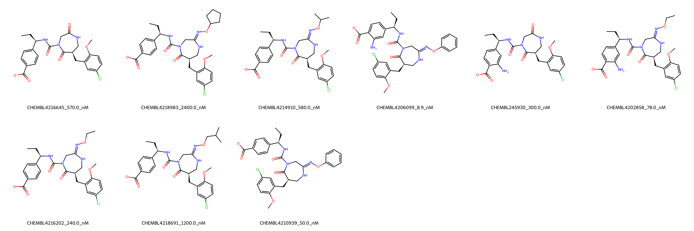

# CMA1 System FEP Calculation Results Analysis

## Introduction

CMA1 (Chymase 1) is a serine protease primarily expressed in mast cells that plays important roles in various physiological and pathological processes. It is involved in the conversion of angiotensin I to angiotensin II, extracellular matrix degradation, and tissue remodeling. CMA1 has emerged as a therapeutic target for cardiovascular diseases, fibrosis, and inflammatory conditions due to its role in tissue homeostasis and inflammation.

## Molecules

The CMA1 system dataset in this study consists of 9 compounds, featuring a complex scaffold with multiple chiral centers. The compounds share a common core structure containing a urea linkage and a carboxylate-substituted phenyl ring. These molecules demonstrate structural diversity through various substituents, including different oxime ethers, chloro-methoxyphenyl groups, and modifications to the benzoic acid moiety.

The experimentally determined binding affinities range from 8.9 nM to 2400 nM, spanning approximately three orders of magnitude, with binding free energies from -7.66 to -10.98 kcal/mol.

## Conclusions

The FEP calculation results for the CMA1 system show good correlation with experimental data, achieving an R² of 0.67 and an RMSE of 0.90 kcal/mol. Several compounds demonstrated excellent prediction accuracy, such as CHEMBL4210939 (experimental: -9.96 kcal/mol, predicted: -9.91 kcal/mol) and CHEMBL4206099 (experimental: -10.98 kcal/mol, predicted: -11.92 kcal/mol). The predicted binding free energies ranged from -7.19 to -11.92 kcal/mol, generally capturing the relative binding trends of the series.

## References

For more information about the CMA1 target and associated bioactivity data, please visit:
https://www.ebi.ac.uk/chembl/explore/assay/CHEMBL4182330 