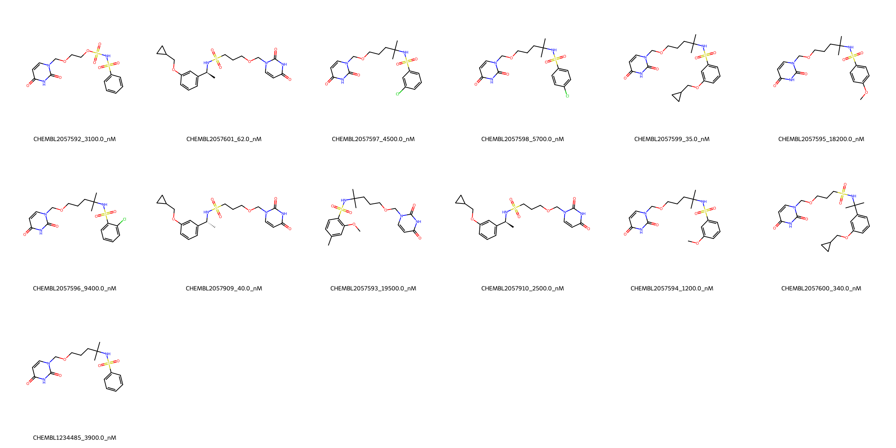

# DUT System FEP Calculation Results Analysis

> This README is generated by AI model using verified experimental data and Uni-FEP calculation results. Content may contain inaccuracies and is provided for reference only. No liability is assumed for outcomes related to its use.

## Introduction

DUT (dUTPase, dUTP pyrophosphatase) is an essential enzyme that catalyzes the hydrolysis of dUTP to dUMP and pyrophosphate. This reaction is crucial for maintaining DNA integrity by preventing the misincorporation of uracil into DNA and providing the substrate for thymidylate synthesis. DUT has emerged as an important therapeutic target, particularly in cancer treatment, due to its role in nucleotide metabolism and cell survival. The enzyme's importance in both normal cellular function and disease states makes it an attractive target for drug development.

## Molecules

The DUT system dataset consists of 13 compounds featuring a common structural framework with a uracil-containing terminal group connected through an alkoxy linker to a sulfonamide core. These compounds demonstrate structural diversity through various substituents on the phenyl ring, including chloro, methoxy, and cyclopropylmethoxy groups. The dataset also includes compounds with different substitution patterns and stereochemical variations at the sulfonamide nitrogen.

The experimentally determined binding affinities span a wide range from 35.0 nM to 19500.0 nM, corresponding to binding free energies from -6.42 to -10.17 kcal/mol. This approximately 550-fold range in binding affinity provides an excellent distribution for evaluating the FEP calculations.

## Conclusions

The FEP calculations for the DUT system show moderate predictive performance with an R² of 0.40 and an RMSE of 1.10 kcal/mol. Some compounds showed good prediction accuracy, such as CHEMBL1234485 (experimental: -7.38 kcal/mol, predicted: -7.39 kcal/mol) and CHEMBL2057600 (experimental: -8.82 kcal/mol, predicted: -8.68 kcal/mol). While the predictions captured some trends in binding affinity variations, there were notable deviations for certain compounds, particularly those with more complex substitution patterns.

## References

For more information about the DUT target and associated bioactivity data, please visit:
https://www.ebi.ac.uk/chembl/explore/assay/CHEMBL2060493 