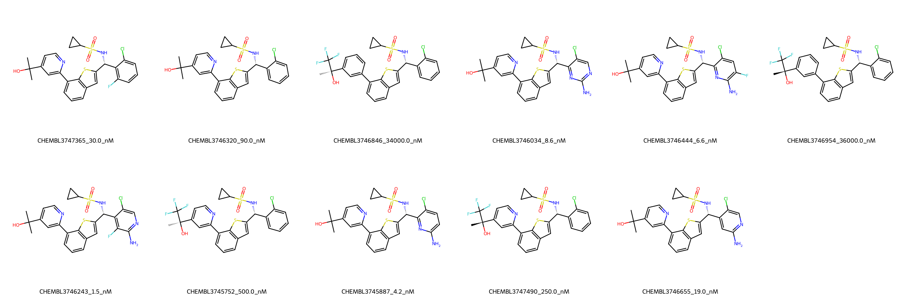

# GCKR System FEP Calculation Results Analysis

## Target Introduction

GCKR (Glucokinase Regulatory Protein) is a key metabolic regulator that plays a crucial role in glucose homeostasis by modulating the activity of glucokinase (GK), the primary glucose sensor in hepatocytes. It functions as a competitive inhibitor of glucokinase in low glucose conditions and releases it when glucose levels rise. GCKR has emerged as an important therapeutic target for type 2 diabetes and related metabolic disorders, as its modulation can affect hepatic glucose metabolism and lipid homeostasis. The development of GCKR modulators represents a promising approach for treating metabolic diseases.

## Dataset Analysis

The GCKR system dataset in this study comprises 11 compounds, featuring a complex scaffold with a thiophene-benzene core linked to a pyridine ring. These compounds demonstrate structural diversity through various substituents, including chloro-substituted phenyl rings, cyclopropylsulfonamide groups, and different modifications at the pyridine terminus. A notable feature is the presence of a tertiary alcohol group that appears to be important for binding affinity.

The experimentally determined binding affinities range from 1.5 nM to 36000.0 nM, spanning approximately four orders of magnitude, with binding free energies from -6.06 to -12.03 kcal/mol.

## Conclusions

The FEP calculation results for the GCKR system demonstrate excellent predictive performance with an R² of 0.87 and an RMSE of 0.69 kcal/mol. The predicted binding free energies (-6.72 to -11.81 kcal/mol) show strong correlation with experimental values. Several compounds showed excellent prediction accuracy, such as CHEMBL3746655 (experimental: -10.53 kcal/mol, predicted: -10.67 kcal/mol) and CHEMBL3747490 (experimental: -9.00 kcal/mol, predicted: -8.86 kcal/mol). The most potent compound, CHEMBL3746243, with an experimental binding free energy of -12.03 kcal/mol, was well predicted at -11.53 kcal/mol.

## References

For more information about the GCKR target and associated bioactivity data, please visit:
https://www.ebi.ac.uk/chembl/explore/assay/CHEMBL3751185 