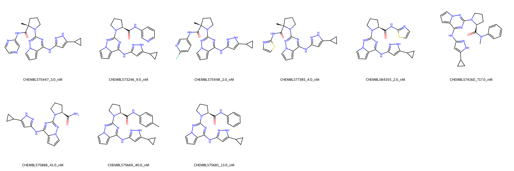

# IGF1R System FEP Calculation Results Analysis

> This README is generated by AI model using verified experimental data and Uni-FEP calculation results. Content may contain inaccuracies and is provided for reference only. No liability is assumed for outcomes related to its use.

## Introduction

IGF1R (Insulin-like Growth Factor 1 Receptor) is a transmembrane receptor tyrosine kinase that plays a crucial role in cell growth, differentiation, and survival. It is activated by insulin-like growth factors (IGFs) and mediates important signaling pathways involved in normal development and tissue growth. IGF1R has emerged as an important therapeutic target in cancer treatment, as its overexpression or hyperactivation is associated with various types of cancer. The development of selective IGF1R inhibitors represents a promising approach for cancer therapy.

## Molecules

The IGF1R system dataset in this study comprises 9 compounds, featuring a complex scaffold with a cyclopropyl-pyrazole core linked to a pyrimidine-based system. These compounds demonstrate structural diversity through various substituents on the terminal aromatic rings, including fluoro groups, thiophene rings, and different alkyl modifications. A notable feature is the presence of a cyclopropyl group that appears to be conserved across the series.

The experimentally determined binding affinities range from 2.0 nM to 717.0 nM, spanning approximately three orders of magnitude, with binding free energies from -8.38 to -11.86 kcal/mol.

## Conclusions

The FEP calculation results for the IGF1R system show moderate predictive performance with an R² of 0.38 and an RMSE of 1.08 kcal/mol. The predicted binding free energies (-8.85 to -12.74 kcal/mol) show some correlation with experimental values, though with notable variations. Several compounds showed reasonable prediction accuracy, such as CHEMBL575681 (experimental: -10.75 kcal/mol, predicted: -10.86 kcal/mol) and CHEMBL575888 (experimental: -10.07 kcal/mol, predicted: -10.46 kcal/mol). The most potent compound, CHEMBL575448, with an experimental binding free energy of -11.86 kcal/mol, was predicted at -12.74 kcal/mol.

## References

For more information about the IGF1R target and associated bioactivity data, please visit:
https://www.ebi.ac.uk/chembl/explore/assay/CHEMBL1045057 