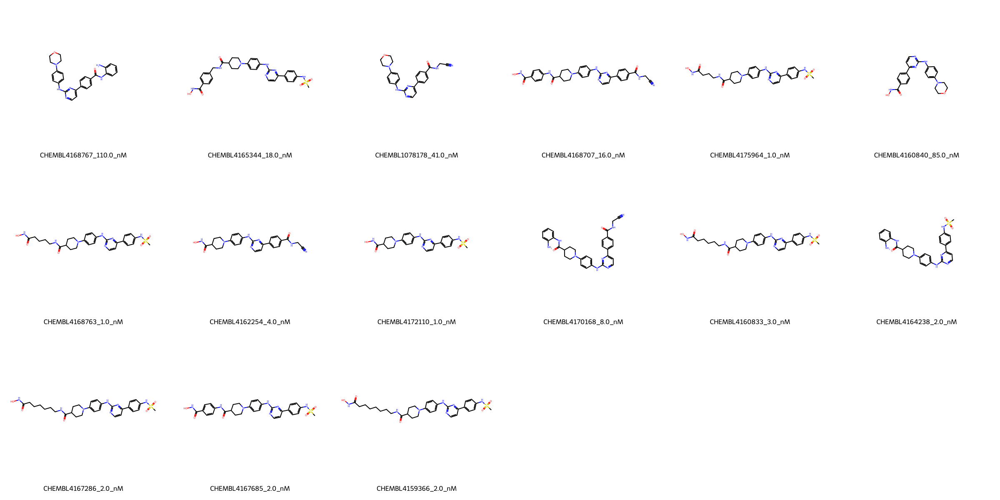

# JAK2 System FEP Calculation Results Analysis

## Introduction

JAK2 (Janus Kinase 2) is a non-receptor tyrosine kinase that plays a crucial role in various cellular processes, including cell growth, development, and immune function. It is a key component of the JAK-STAT signaling pathway, which is essential for the signal transduction of many cytokines and growth factors. JAK2 has emerged as an important therapeutic target, particularly in myeloproliferative disorders and various types of cancer, where mutations or dysregulation of JAK2 contribute to disease progression. The development of selective JAK2 inhibitors represents a significant approach in treating these conditions.

## Molecules

The JAK2 system dataset in this study comprises 15 compounds, featuring a complex scaffold with a pyrimidine core linked to various substituted phenyl rings. These compounds demonstrate structural diversity through different modifications, including hydroxamic acid groups, sulfonamides, and various linker lengths in the side chains. A notable feature is the presence of morpholine and piperidine rings that appear to be important for binding affinity.

The experimentally determined binding affinities range from 1.0 nM to 110.0 nM, spanning approximately two orders of magnitude, with binding free energies from -9.49 to -12.27 kcal/mol.

## Conclusions

The FEP calculation results for this JAK2 system show moderate predictive performance with an R² of 0.55 and an RMSE of 0.83 kcal/mol. The predicted binding free energies (-7.54 to -12.32 kcal/mol) generally correlate with experimental values, though with some variations. Several compounds showed excellent prediction accuracy, such as CHEMBL4159366 (experimental: -11.86 kcal/mol, predicted: -11.83 kcal/mol) and CHEMBL4164238 (experimental: -11.86 kcal/mol, predicted: -12.01 kcal/mol). The most potent compounds, including CHEMBL4175964, CHEMBL4168763, and CHEMBL4172110, all with experimental binding free energies of -12.27 kcal/mol, were well predicted with values ranging from -11.56 to -11.99 kcal/mol.

## References

For more information about the JAK2 target and associated bioactivity data, please visit:
https://www.ebi.ac.uk/chembl/explore/assay/CHEMBL4150584 