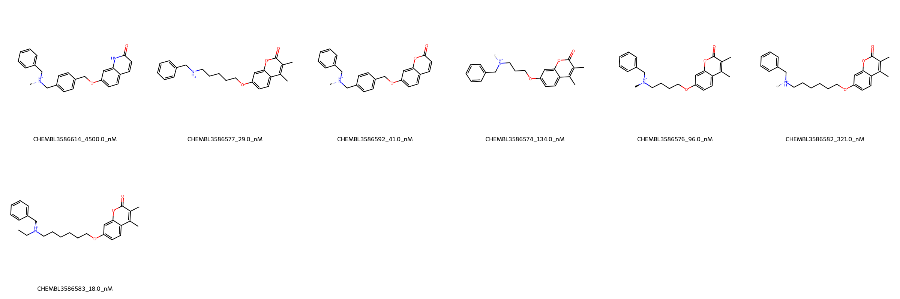

# MAOB System FEP Calculation Results Analysis

## Target Introduction

MAOB (Monoamine Oxidase B) is a flavoenzyme located in the outer mitochondrial membrane that catalyzes the oxidative deamination of biogenic and xenobiotic amines. It plays crucial roles in the metabolism of neurotransmitters and is particularly important in the central nervous system. MAOB has emerged as an important therapeutic target for neurological disorders, including Parkinson's disease and depression, due to its role in neurotransmitter regulation.

## Dataset Analysis

The MAOB system dataset in this study consists of 7 compounds, featuring a core structure with a phenethylamine scaffold. The compounds share a common phenyl ring connected to a protonated amine, with various alkoxy linkers connecting to coumarin or quinolone derivatives. These molecules demonstrate structural diversity through different chain lengths between the amine and the oxygen atom, as well as variations in the heterocyclic ring systems.

The experimentally determined binding affinities range from 18 nM to 4500 nM, spanning approximately three orders of magnitude, with binding free energies from -7.29 to -10.56 kcal/mol.

## Conclusions

The FEP calculation results for the MAOB system show moderate correlation with experimental data, achieving an R² of 0.61 and a relatively high RMSE of 1.67 kcal/mol. Several compounds demonstrated good prediction accuracy, such as CHEMBL3586583 (experimental: -10.56 kcal/mol, predicted: -10.62 kcal/mol) and CHEMBL3586582 (experimental: -8.85 kcal/mol, predicted: -8.64 kcal/mol). The predicted binding free energies ranged from -4.90 to -12.54 kcal/mol, showing some deviation from the experimental range but generally capturing the relative binding trends.

## References

For more information about the MAOB target and associated bioactivity data, please visit:
https://www.ebi.ac.uk/chembl/explore/assay/CHEMBL3588480 