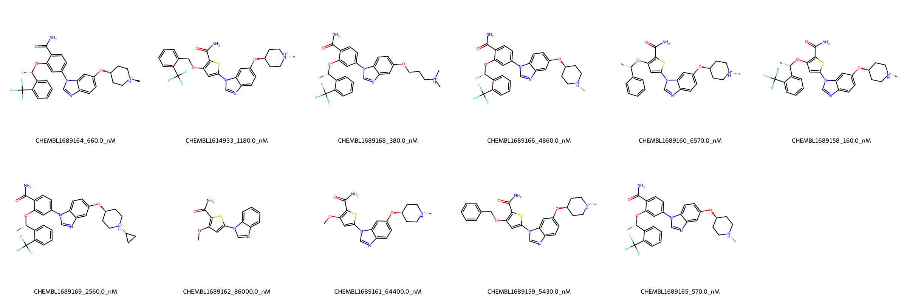

# NEK2 System FEP Calculation Results Analysis

## Target Introduction

NEK2 (NIMA-related kinase 2) is a serine/threonine protein kinase that plays a crucial role in cell cycle regulation, particularly during mitosis. It is involved in centrosome separation, spindle formation, and chromosome segregation. NEK2 has emerged as an important therapeutic target in cancer treatment, as its overexpression is associated with various types of cancer, including breast cancer, colorectal cancer, and lung cancer. The development of NEK2 inhibitors represents a promising strategy for cancer therapy.

## Dataset Analysis

The NEK2 system dataset in this study comprises 12 compounds featuring a common thiophene-pyrazole scaffold with various substituents. These compounds share a core structure that includes an amide group and a cyclic amine moiety. Key structural variations include different substitution patterns on the phenyl ring, particularly with trifluoromethyl groups, and modifications to the cyclic amine portion.

The experimentally determined binding affinities span a wide range from 160 nM to 86000 nM, corresponding to binding free energies from -5.54 to -9.27 kcal/mol. This broad range of affinities provides a good test set for evaluating the FEP methodology's predictive capabilities across different binding strengths.

## Conclusions

The FEP calculation results for the NEK2 system show moderate predictive performance with an R² of 0.35 and an RMSE of 1.12 kcal/mol. While some compounds showed good agreement between experimental and predicted values, such as CHEMBL1689165 (experimental: -8.51 kcal/mol, predicted: -8.20 kcal/mol), others displayed larger deviations. The most potent compound in the series, CHEMBL1689158 (experimental: -9.27 kcal/mol), was reasonably well predicted with a calculated binding free energy of -8.67 kcal/mol.

The moderate correlation suggests that additional factors may influence binding that are not fully captured by the current FEP implementation, such as complex water-mediated interactions or conformational changes upon binding.

## References

For more information about the NEK2 target and associated bioactivity data, please visit:
https://www.ebi.ac.uk/chembl/explore/assay/CHEMBL1693342 