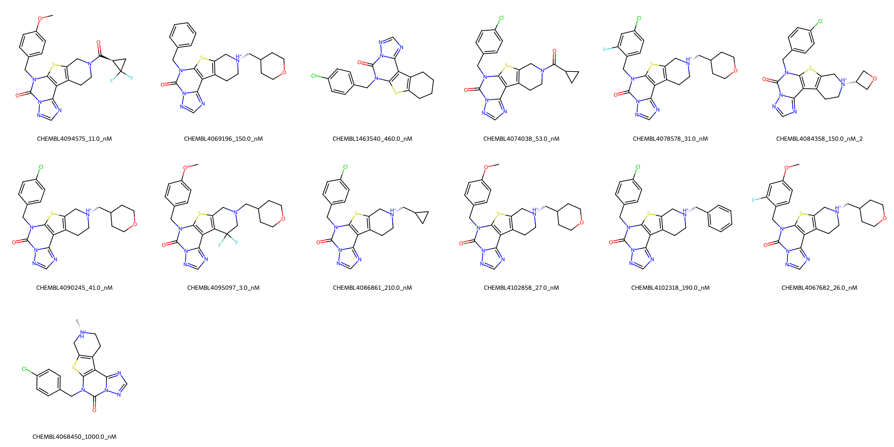

# PDE1B System FEP Calculation Results Analysis

## Introduction

PDE1B (Phosphodiesterase 1B) is a calcium/calmodulin-dependent phosphodiesterase that plays a crucial role in signal transduction by regulating intracellular levels of cyclic nucleotides (cAMP and cGMP). It is highly expressed in the brain and is involved in dopaminergic signaling and cognitive function. PDE1B has emerged as an important therapeutic target for treating various neurological and psychiatric disorders, including cognitive impairment, schizophrenia, and movement disorders. The development of selective PDE1B inhibitors represents a promising approach for treating these conditions.

## Molecules

The PDE1B system dataset in this study comprises 13 compounds, featuring a complex tricyclic scaffold with a thiadiazole core fused to a pyrimidine ring. These compounds demonstrate structural diversity through various substituents, including chloro and methoxy groups on the benzyl ring, and different amine-containing side chains. A notable feature is the presence of cyclic amine substituents that appear to be important for binding affinity.

The experimentally determined binding affinities range from 3.0 nM to 1000.0 nM, spanning approximately three orders of magnitude, with binding free energies from -8.18 to -11.62 kcal/mol.

## Conclusions

The FEP calculation results for the PDE1B system show moderate predictive performance with an R² of 0.51 and an RMSE of 1.16 kcal/mol. The predicted binding free energies (-7.48 to -13.15 kcal/mol) generally correlate with experimental values, though with some notable variations. Several compounds showed good prediction accuracy, such as CHEMBL4067682 (experimental: -10.34 kcal/mol, predicted: -10.61 kcal/mol) and CHEMBL4068450 (experimental: -8.18 kcal/mol, predicted: -8.43 kcal/mol). The most potent compound, CHEMBL4095097, with an experimental binding free energy of -11.62 kcal/mol, was predicted at -12.42 kcal/mol.

## References

For more information about the PDE1B target and associated bioactivity data, please visit:
https://www.ebi.ac.uk/chembl/explore/assay/CHEMBL4011522 