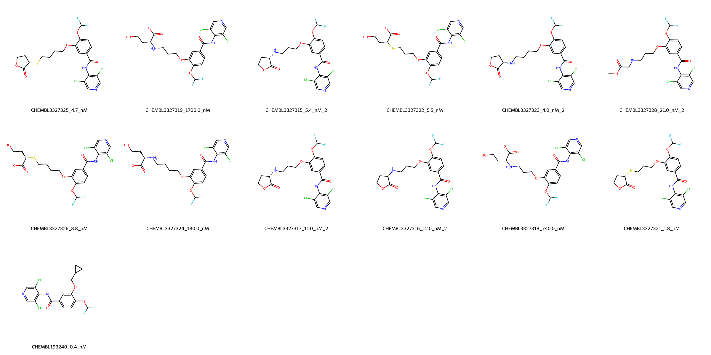

# PDE4B System FEP Calculation Results Analysis

## Introduction

PDE4B (Phosphodiesterase 4B) is a member of the phosphodiesterase family that specifically hydrolyzes cyclic adenosine monophosphate (cAMP) to regulate intracellular cAMP levels. It plays crucial roles in various cellular processes, including inflammation, cognition, and psychiatric functions. PDE4B is particularly important in inflammatory cells and the central nervous system, where it modulates immune responses and neurotransmitter signaling. Its selective inhibition has shown therapeutic potential in treating inflammatory diseases, such as asthma and chronic obstructive pulmonary disease (COPD), as well as cognitive and psychiatric disorders.

## Molecules

The PDE4B system dataset in this study comprises 13 compounds, all competitive inhibitors, with molecular weights ranging from 450 to 600 Da. The compounds share a common dichloropyridine-based core scaffold and demonstrate structural diversity through different substituents, particularly in the linker region. These compounds feature key structural characteristics complementary to the PDE4B catalytic site, including hydrogen bond donors and acceptors interacting with key residues, aromatic systems forming π-stacking interactions, and various substituents exploring the specificity pocket.

The experimentally determined binding affinities range from 0.4 nM to 1.7 μM, spanning approximately four orders of magnitude, with binding free energies from -7.87 to -12.81 kcal/mol.

## Conclusions

The FEP calculation results for the PDE4B system show that the predicted values (-8.60 to -12.57 kcal/mol) align well with the experimental range. The overall prediction accuracy achieved an R² of 0.79 and an RMSE of 0.62 kcal/mol, indicating good predictive performance. Several compounds demonstrated excellent prediction results, such as CHEMBL193240 (experimental: -12.81 kcal/mol, predicted: -12.73 kcal/mol) and CHEMBL3327321 (experimental: -11.92 kcal/mol, predicted: -12.14 kcal/mol).

## References

For more information about the PDE4B target and associated bioactivity data, please visit:
https://www.ebi.ac.uk/chembl/explore/assay/CHEMBL3374901 