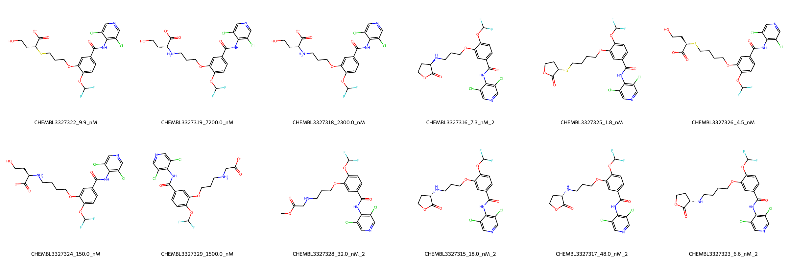

# PDE4D System FEP Calculation Results Analysis

## Target Introduction

PDE4D (Phosphodiesterase 4D) is a member of the phosphodiesterase family that specifically hydrolyzes cyclic AMP (cAMP). It plays a crucial role in various cellular signaling pathways and is particularly important in inflammatory responses and cognitive functions. PDE4D has been identified as a therapeutic target for treating several conditions, including inflammatory diseases, cognitive disorders, and respiratory diseases such as COPD. The development of selective PDE4D inhibitors has been an active area of research due to their potential therapeutic applications.

## Dataset Analysis

The PDE4D system dataset in this study comprises 12 compounds, featuring a dichloropyridine-based scaffold connected to a difluoromethoxy-substituted phenyl ring. These compounds demonstrate structural diversity through various linkers and substituents, including carboxylic acid groups, oxetane rings, and different chain lengths. A notable feature is the presence of polar groups such as carboxylates and amines that appear to be important for binding affinity.

The experimentally determined binding affinities range from 1.8 nM to 7200 nM, spanning approximately three orders of magnitude, with binding free energies from -7.01 to -11.92 kcal/mol.

## Conclusions

The FEP calculation results for the PDE4D system show moderate predictive performance with an R² of 0.55 and an RMSE of 1.05 kcal/mol. The predicted binding free energies (-7.62 to -12.80 kcal/mol) generally correlate with experimental values, though with some notable variations. Several compounds showed good prediction accuracy, such as CHEMBL3327323 (experimental: -11.15 kcal/mol, predicted: -11.02 kcal/mol) and CHEMBL3327324 (experimental: -9.30 kcal/mol, predicted: -9.65 kcal/mol). The most potent compound, CHEMBL3327325, with an experimental binding free energy of -11.92 kcal/mol, was predicted at -12.80 kcal/mol.

## References

For more information about the PDE4D target and associated bioactivity data, please visit:
https://www.ebi.ac.uk/chembl/explore/assay/CHEMBL3374902 