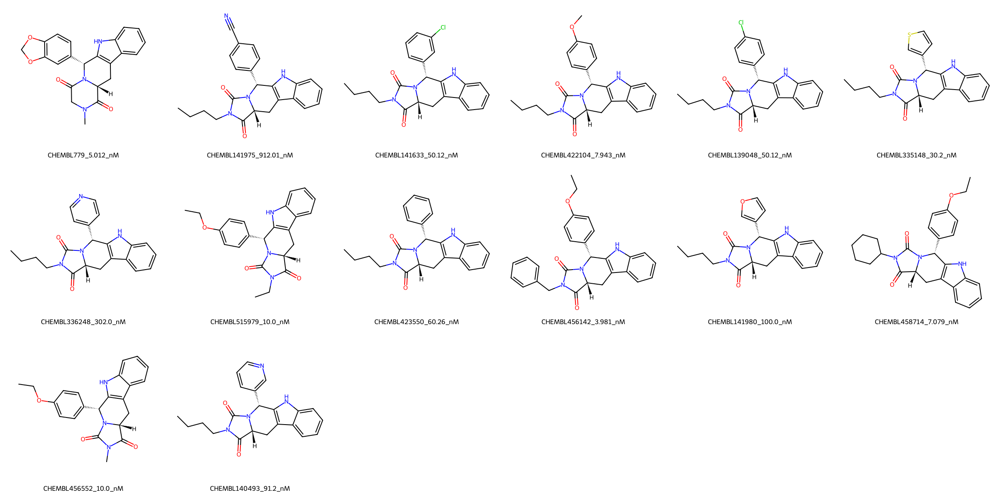

# PDE5A System FEP Calculation Results Analysis

## Target Introduction

PDE5A (Phosphodiesterase 5A) is a cyclic GMP-specific phosphodiesterase that plays a crucial role in regulating intracellular levels of cyclic GMP (cGMP). It is particularly important in smooth muscle relaxation and vascular function. PDE5A has gained significant attention as a therapeutic target, most notably for treating erectile dysfunction and pulmonary arterial hypertension. The enzyme's role in these physiological processes has made it one of the most well-studied and successfully targeted phosphodiesterases in drug development.

## Dataset Analysis

The PDE5A system dataset consists of 14 compounds featuring a complex tricyclic scaffold with a pyrazolopyrimidinone core structure. These compounds demonstrate structural diversity through various substituents, particularly at the phenyl ring position, including methoxy, chloro, and cyano groups. The dataset also includes compounds with different N-alkyl substituents and heterocyclic variations of the core structure.

The experimentally determined binding affinities span a range from 3.98 nM to 912.01 nM, corresponding to binding free energies from -8.24 to -11.45 kcal/mol. This approximately 230-fold range in binding affinity provides a good distribution for evaluating the FEP calculations.

## Conclusions

The FEP calculations for the PDE5A system demonstrate moderate predictive performance with an R² of 0.48 and an RMSE of 0.80 kcal/mol. Several compounds showed excellent prediction accuracy, such as CHEMBL456552 (experimental: -10.91 kcal/mol, predicted: -10.89 kcal/mol) and CHEMBL140493 (experimental: -9.60 kcal/mol, predicted: -9.60 kcal/mol). The predictions captured the general trend of binding affinity variations across the series, though with some notable deviations for certain compounds.

## References

For more information about the PDE5A target and associated bioactivity data, please visit:
https://www.ebi.ac.uk/chembl/explore/assay/CHEMBL968866 