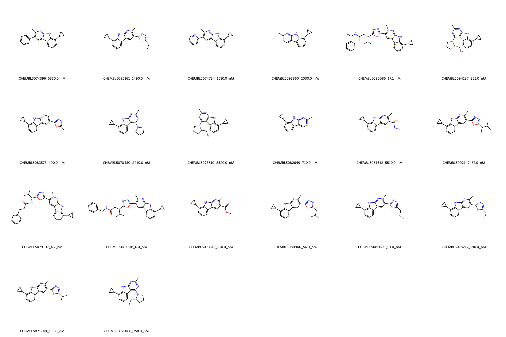

# PDK2 System FEP Calculation Results Analysis

## Target Introduction

PDK2 (Pyruvate Dehydrogenase Kinase 2) is a mitochondrial protein kinase that regulates glucose metabolism by phosphorylating and inactivating the pyruvate dehydrogenase complex. It plays a crucial role in cellular energy metabolism and glucose homeostasis. PDK2 has emerged as an important therapeutic target for metabolic disorders, including diabetes and cancer, due to its role in regulating cellular energy metabolism.

## Dataset Analysis

The PDK2 system dataset in this study consists of 20 compounds, featuring a core structure with a cyclopropyl-substituted pyrrolopyrazine scaffold. The compounds demonstrate structural diversity through various substituents, including isoxazole rings with different alkyl chains, methyl groups, and complex amide-linked substituents. These molecules share a common cyclopropyl group while varying in their heterocyclic substituents and side chains.

The experimentally determined binding affinities range from 4.2 nM to 5510 nM, spanning approximately three orders of magnitude, with binding free energies from -7.17 to -11.42 kcal/mol.

## Conclusions

The FEP calculation results for the PDK2 system show excellent correlation with experimental data, achieving a high R² of 0.88 and a low RMSE of 0.45 kcal/mol. Several compounds demonstrated outstanding prediction accuracy, such as CHEMBL5087238 (experimental: -11.21 kcal/mol, predicted: -11.10 kcal/mol) and CHEMBL5071248 (experimental: -9.39 kcal/mol, predicted: -9.30 kcal/mol). The predicted binding free energies ranged from -6.51 to -11.56 kcal/mol, showing excellent agreement with the experimental range.

## References

For more information about the PDK2 target and associated bioactivity data, please visit:
https://www.ebi.ac.uk/chembl/explore/assay/CHEMBL5057865 