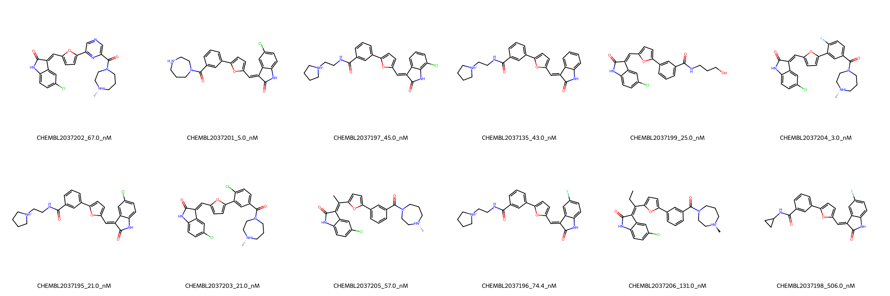

# PIM1 System FEP Calculation Results Analysis

> This README is generated by AI model using verified experimental data and Uni-FEP calculation results. Content may contain inaccuracies and is provided for reference only. No liability is assumed for outcomes related to its use.

## Introduction

PIM1 (Proviral Integration site for Moloney murine leukemia virus-1) is a serine/threonine protein kinase that plays crucial roles in cell survival, proliferation, and differentiation. It is frequently overexpressed in various types of cancers and has been implicated in tumor progression and drug resistance. PIM1 has emerged as an important therapeutic target in oncology, particularly for hematological malignancies and solid tumors. The development of selective PIM1 inhibitors represents a promising approach for cancer treatment.

## Molecules

The PIM1 system dataset in this study comprises 12 compounds, featuring a furan-linked indolinone scaffold. These compounds demonstrate structural diversity through various substituents, including chloro and fluoro groups on the indolinone core, and different basic amine-containing side chains. A notable feature is the presence of piperidine-based substituents that appear to be important for binding affinity.

The experimentally determined binding affinities range from 3.0 nM to 506.0 nM, spanning approximately two orders of magnitude, with binding free energies from -8.58 to -11.62 kcal/mol.

## Conclusions

The FEP calculation results for the PIM1 system show moderate predictive performance with an R² of 0.55 and an RMSE of 0.77 kcal/mol. The predicted binding free energies (-8.50 to -12.56 kcal/mol) generally correlate with experimental values, though with some variations. Several compounds showed good prediction accuracy, such as CHEMBL2037198 (experimental: -8.58 kcal/mol, predicted: -8.50 kcal/mol) and CHEMBL2037203 (experimental: -10.47 kcal/mol, predicted: -11.02 kcal/mol). The most potent compound, CHEMBL2037204, with an experimental binding free energy of -11.62 kcal/mol, was predicted at -10.90 kcal/mol.

## References

For more information about the PIM1 target and associated bioactivity data, please visit:
https://www.ebi.ac.uk/chembl/explore/assay/CHEMBL2038828 