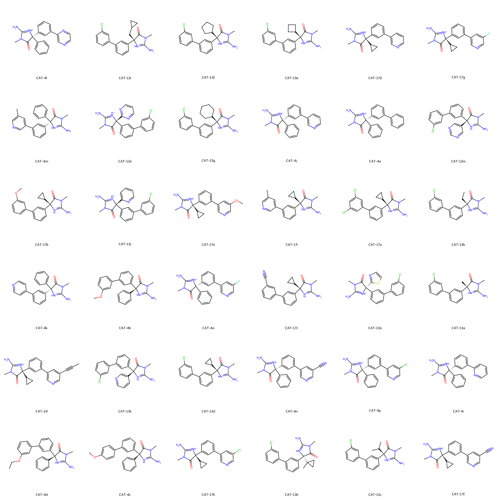

# BACE System FEP Calculation Results Analysis

## Introduction

BACE (β-site APP cleaving enzyme) is an aspartyl protease that plays a crucial role in the pathogenesis of Alzheimer's disease (AD). It serves as the rate-limiting enzyme in the production of amyloid-β (Aβ) by cleaving the amyloid precursor protein (APP). Excessive accumulation of Aβ in the brain leads to the formation of amyloid plaques, which is one of the primary pathological features of Alzheimer's disease. Therefore, the development of BACE inhibitors is considered a significant therapeutic strategy for treating Alzheimer's disease and has attracted considerable attention in drug development efforts.

## Molecules

The BACE system dataset in this study comprises 36 compounds, primarily aspartyl protease inhibitors. All compounds contain a characteristic guanidine fragment as a key pharmacophore, with molecular weights ranging from 450 to 650 Da. These molecules typically include multiple aromatic ring systems, with common substituents such as chlorine atoms, cyano groups, and methoxy groups. The molecular scaffolds often feature small ring structures like cyclopropyl and cyclobutyl groups, which increase molecular rigidity.

The experimentally determined binding free energies range from -7.85 to -11.35 kcal/mol.

## Conclusions

The FEP calculation results for the BACE system show that the predicted values (-7.20 to -11.43 kcal/mol) closely align with the experimental range. The overall prediction accuracy achieved an R² of 0.47 and an RMSE of 0.80 kcal/mol. Several compounds demonstrated excellent prediction results, such as CAT-13c with a predicted value (-9.37 kcal/mol) differing by only 0.05 kcal/mol from its experimental value (-9.32 kcal/mol), and CAT-17f with a predicted value (-9.41 kcal/mol) showing strong agreement with its experimental value (-9.42 kcal/mol). Additionally, good prediction accuracy was observed for compound CAT-24 (experimental: -11.35 kcal/mol, predicted: -11.10 kcal/mol), which contains special substituents. 