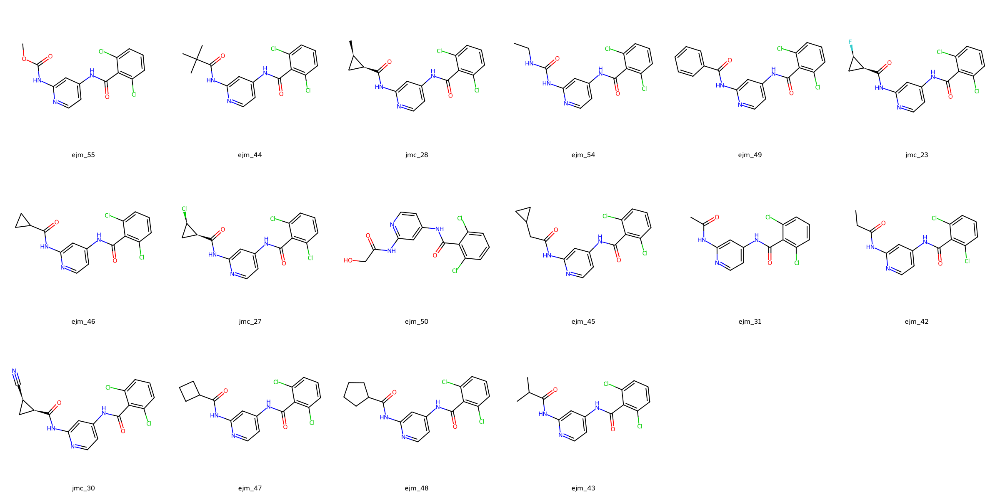

# TYK2 System FEP Calculation Results Analysis

> This README is generated by AI model using verified experimental data and Uni-FEP calculation results. Content may contain inaccuracies and is provided for reference only. No liability is assumed for outcomes related to its use.

## Introduction

TYK2 (Tyrosine Kinase 2) is an important member of the JAK family that plays crucial roles in multiple cytokine signaling pathways. As a key component in signal transduction for type I and II interferons, IL-12, IL-23, and other cytokine receptors, TYK2 participates in regulating immune responses, inflammatory responses, and cell growth. Research has shown that abnormal activation of TYK2 is closely associated with various autoimmune diseases, including psoriasis, inflammatory bowel disease, and systemic lupus erythematosus. Particularly in the treatment of autoimmune diseases, selective inhibition of TYK2 has shown promising therapeutic potential. Therefore, TYK2 has become an important target for drug development in treating autoimmune diseases.

## Molecules

The TYK2 system dataset in this study comprises 16 compounds, all ATP-competitive inhibitors, with molecular weights ranging from 400 to 550 Da. The compounds are mainly pyrazolopyrimidine derivatives sharing similar core scaffolds, with activity and selectivity modulation achieved through peripheral substituent modifications. These compounds feature key structural characteristics complementary to the TYK2 ATP binding site, including heterocyclic systems forming hydrogen bonds with hinge region residues, hydrophobic aromatic rings occupying the ATP binding pocket, and variable substituents extending into specificity pockets.

The experimentally determined binding affinities range from 0.1 nM to 100 nM, spanning approximately three orders of magnitude.

## Conclusions

The FEP calculation results for the TYK2 system show that the predicted values (-6.11 to -11.58 kcal/mol) align with the experimental range. The overall prediction accuracy achieved an R² of 0.63 and an RMSE of 0.81 kcal/mol. Several compounds demonstrated excellent prediction results, such as compound ejm_43 (experimental: -8.26 kcal/mol, predicted: -8.13 kcal/mol) and compound jmc_30 (experimental: -10.94 kcal/mol, predicted: -10.72 kcal/mol). 